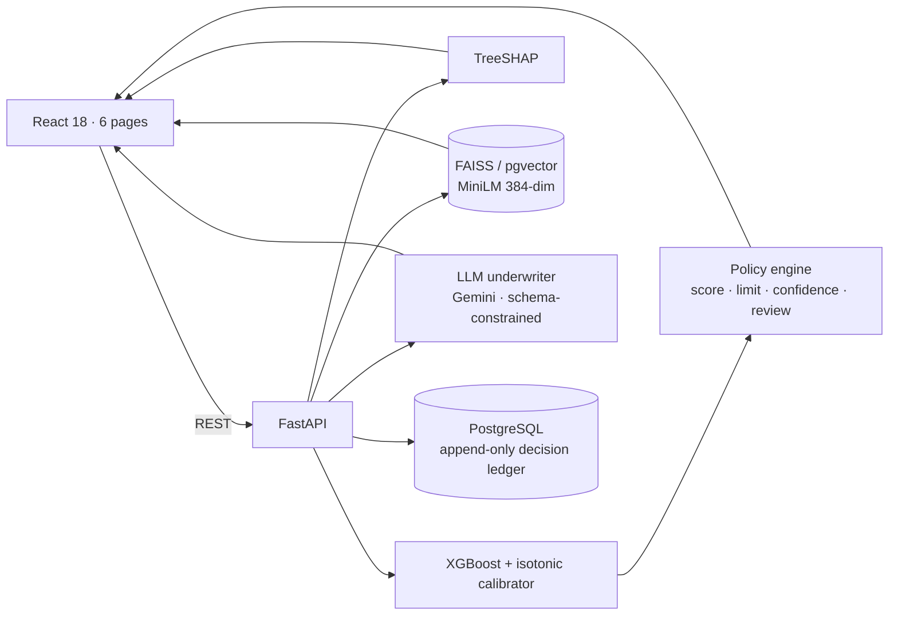

# CreditAssess

**A real-time, multi-modal underwriting engine for New-To-Credit (NTC) and thin-file borrowers.**

Traditional underwriting asks "what does the bureau say?". For roughly a third of
applicants in the Home Credit dataset the honest answer is *nothing* — and a
missing bureau score is treated as a bad one. This engine underwrites those
applicants from behaviour instead: cash-flow, tenure, utility and mobile-recharge
consistency, spending stability and digital trust — then explains every decision
factor by factor, corroborates it against similar historical borrowers, and
records the whole thing for audit.

It does not return APPROVE/REJECT. It returns a **risk score, a recommended
credit limit, a confidence score, peer evidence and a written underwriting memo** —
and it says out loud when a human needs to look.

---

## What it does

| Capability | Implementation |
|---|---|
| Probability of default | XGBoost + isotonic calibration · CV ROC AUC **0.767** |
| Behavioural / alternative data | 11 engineered scores, **~10% of total model gain** |
| Risk score | 300–900 log-odds scorecard (40 PDO), A1–D2 bands |
| Credit limit | DTI-capped affordability × risk multiplier × behaviour adjustment |
| Confidence | data sufficiency × decisiveness × peer agreement |
| Explainability | Exact TreeSHAP, per-factor PD impact in percentage points |
| Similar borrowers | MiniLM embeddings + FAISS/pgvector cosine KNN with repayment outcomes |
| AI underwriting memo | Gemini under a grounded, schema-constrained prompt (deterministic fallback) |
| Fraud awareness | 8 rule-based anomaly tells routed to human review |
| Responsible AI | Four-fifths rule, equal-opportunity gap, calibration by group, append-only audit trail |

### Measured results (61,503-row holdout)

| Policy band | Share of book | Predicted PD | **Observed default rate** |
|---|---|---|---|
| Auto-approve (PD ≤ 6%) | 55.8% | 2.89% | **2.98%** |
| Manual review | 29.5% | 9.74% | **9.37%** |
| Decline (PD ≥ 17%) | 14.8% | 23.6% | **24.7%** |

Predicted and observed agree band by band — the number the policy engine
thresholds is a real probability, not a rank score. Portfolio base default rate
is 8.07%; the auto-approved book runs at 2.98%.

---

## Quick start

```bash
# 0. dependencies (Python 3.11 recommended)
py -3.11 -m venv .venv
.venv/Scripts/python -m pip install -r requirements.txt     # macOS/Linux: .venv/bin/python

# 1. data — place the Home Credit files in data/
#    data/application_train.csv, data/application_test.csv

# 2. train the model (~10 min full dataset; CI_TRAIN_ROWS=50000 for a fast run)
.venv/Scripts/python -m ml.train

# 3. build the vector index (~8 min for 20k borrowers on CPU)
.venv/Scripts/python -m embeddings.build_index

# 4. fairness audit
.venv/Scripts/python -m ml.bias_check

# 5. API  ->  http://localhost:8000/docs
.venv/Scripts/python -m backend.run

# 6. UI   ->  http://localhost:5173
cd frontend && npm install && npm run dev
```

Optional: `docker compose up -d postgres` for the Postgres + pgvector path, and
`GEMINI_API_KEY` in `.env` for Gemini-written memos. **Neither is required** —
the engine degrades gracefully and `/health` reports exactly which path is live.

---

## Architecture



Full diagrams, sequence flow and failure behaviour: [`docs/architecture.md`](docs/architecture.md).

---

## Project structure

```
.
├── data/                          Home Credit CSVs
├── ml/                            model + policy + explainability
│   ├── config.py                  every path in one place
│   ├── features.py                11 behavioural scores, stateless & bounded
│   ├── train.py                   XGBoost + isotonic calibration + 5-fold CV
│   ├── inference.py               model registry / scoring runtime
│   ├── policy.py                  risk score, limit, confidence, review, fraud flags
│   ├── explain.py                 TreeSHAP local + global
│   ├── bias_check.py              fairness audit
│   └── artifacts/                 model, calibrator, metrics, importance
├── embeddings/
│   ├── profile_builder.py         row -> natural-language borrower profile
│   ├── vector_store.py            MiniLM encoder + FAISS / pgvector / numpy stores
│   ├── build_index.py             embedding pipeline
│   └── artifacts/                 index + metadata
├── backend/
│   ├── app/
│   │   ├── main.py                app factory, lifespan wiring, middleware
│   │   ├── schemas.py             Pydantic contracts
│   │   ├── models.py              SQLAlchemy ORM
│   │   ├── core/                  settings, DB session + in-memory fallback
│   │   ├── routers/               predict · similar · report · health · analytics
│   │   └── services/              scoring · similar · llm · prompts · audit · demo_seed
│   ├── Dockerfile
│   └── run.py
├── database/schema.sql            7 tables, 4 analytics views, pgvector index
├── frontend/src/
│   ├── pages/                     Dashboard · Intake · Risk · Similar · Report · Analytics
│   ├── components/ui.jsx          gauge, meters, stat cards, badges
│   ├── api/client.js              typed-ish API client + formatters
│   └── styles/theme.css           BFSI design system
├── docs/                          architecture · implementation plan · prompts · api
├── scripts/demo.py                end-to-end smoke test
└── docker-compose.yml
```

---

## How the thin-file problem is actually solved

**1. Missing bureau data is modelled, not imputed.** `EXT_SOURCE_*` stays `NaN`
at inference; XGBoost learns a dedicated default split direction for it. Imputing
a median would silently tell the model this applicant is average.

**2. Behavioural evidence replaces credit history.** Eleven scores derived from
signals every applicant has:

| Score | What it stands in for |
|---|---|
| `payment_consistency_score` | Meeting scheduled obligations |
| `utility_payment_consistency` | Household bill discipline |
| `mobile_recharge_consistency` | Uninterrupted telco recharge history |
| `digital_trust_score` | Digital footprint breadth and stability |
| `spending_stability_score` | Purchase discipline vs cash-out overreach |
| `income_stability_score` | Durable, formal income |
| `credit_utilization_score` | Remaining capacity headroom |
| `monthly_cashflow_consistency` | Surplus after the instalment |
| `transaction_volatility` | Cash-flow noise (lower is better) |
| `financial_discipline_score` | Weighted composite |
| `thin_file_score` / `is_ntc` | Explicit thin-file flag |

**3. Uncertainty is priced, not hidden.** A thin file lowers `data_sufficiency`,
which lowers confidence, which routes large first facilities to a human — instead
of quietly declining.

**4. Policy is tighter, not the score.** NTC applicants get a 35% DTI cap versus
45%, so the caution lands on exposure rather than on access.

---

## Responsible AI

* **Bias checks** — selection rate, disparate-impact ratio (four-fifths rule),
  equal-opportunity gap, group AUC and calibration gap across gender, age band,
  education, family status, income band and file type. `GET /analytics/bias`.
* **Confidence score** — every decision states how much the engine trusts itself,
  with the three drivers exposed.
* **Human review** — six explicit triggers (confidence floor, PD boundary
  proximity, large NTC first facility, fraud flags, capacity shortfall, and zero
  bureau coverage *outside the straight-through margin*). Triggers downgrade
  APPROVE to REVIEW; they never upgrade. Note the qualifier on the last one: a
  thin-file applicant whose PD sits at or below half the approve cut-off, with no
  fraud flags, is still auto-approved — an unconditional bureau veto would make
  the review queue a de-facto decline for exactly the population this engine
  exists to serve.
* **Audit logging** — append-only `predictions` and `audit_logs` with model and
  policy version, payload SHA-256, latency and the frozen feature snapshot.
* **Explainability** — TreeSHAP on every decision; the LLM may only cite those
  contributions, and protected attributes are omitted from its context entirely
  so it cannot reason from them.
* **Fraud awareness** — eight anomaly tells surfaced next to the score and
  printed verbatim in the memo with the verification that would clear each.

### Fairness audit results — and what they actually say

`python -m ml.bias_check` on 80,000 applicants. **The audit does not pass
cleanly, and the product shows that rather than hiding it:**

| Slice | Group | Selection rate | Disparate impact | Observed default | Group AUC |
|---|---|---|---|---|---|
| gender | F | 62.0% | 1.00 | — | 0.826 |
| gender | M | 44.7% | **0.72** ✗ | — | 0.829 |
| file type | thick file | 57.7% | 1.00 | 7.8% | — |
| file type | new to credit | 39.7% | **0.69** ✗ | 10.8% | — |

Twelve group/slice combinations fall below the four-fifths threshold (age bands,
education levels, family status, lower income bands, and NTC).

**Reading it honestly.** Disparate impact measures *selection-rate parity*, not
error. Where a group's observed default rate genuinely differs — NTC applicants
default at 10.8% versus 7.8% — a risk-accurate model will select them less often,
and group AUCs are near-identical (0.826 vs 0.829), so the model is not *less
accurate* for any audited group. That is a real trade-off between parity and
accuracy, not a bug to be silently patched.

**What the engine does about it:**

1. Surfaces every failing slice at `GET /analytics/bias` and on the Analytics page.
2. Ships `python -m ml.train --strict-fairness`, which drops gender, age and
   family status from the model matrix entirely.
3. Keeps protected attributes out of the LLM context, so no memo can reason from them.
4. Routes thin-file cases to human review instead of declining them, and tightens
   exposure (35% DTI) rather than access.

**What it does not do:** apply group-specific thresholds. That is a lending-policy
and legal decision, not an engineering one, and it belongs to the institution.

---

## Model card (short)

| | |
|---|---|
| Task | Binary probability of default on a 12–36 month retail facility |
| Data | Home Credit `application_train.csv`, 307,511 rows, 8.07% default rate |
| Features | 36 raw + 20 document flags + 23 ratios + 11 behavioural + 11 categorical |
| Algorithm | XGBoost `hist`, depth 6, lr 0.05, early stopping on validation AUC |
| Calibration | Isotonic on a held-out 36,902-row validation split |
| Performance | CV ROC AUC 0.767 ± 0.004 · PR AUC 0.253 · Brier 0.067 |
| Known limits | Trained on accepted applicants only (survivorship bias in the label); the behavioural block is *proxied* from the application table — with `bureau.csv` and `installments_payments.csv` it would be measured directly |
| Not for | Automated adverse action without the human-review path enabled |

---

## Endpoints

| Method | Path | Purpose |
|---|---|---|
| `POST` | `/predict` | Risk score, recommendation, limit, confidence, SHAP, peers |
| `POST` | `/similar-borrowers` | Top-K peers + repayment success rate + similarity |
| `POST` | `/underwriting-report` | AI underwriting memo + the decision it explains |
| `GET` | `/health` | Per-subsystem readiness |
| `GET` | `/analytics/*` | Metrics · importance · bias · policy · portfolio · audit · review queue |

Full request/response shapes: [`docs/api.md`](docs/api.md).

---

## Documentation

| Document | Contents |
|---|---|
| [`docs/architecture.md`](docs/architecture.md) | System, sequence and decision diagrams; component rationale; failure behaviour |
| [`docs/prompt_engineering.md`](docs/prompt_engineering.md) | Prompt anatomy, grounding rules, schema, worked example, anti-patterns |
| [`docs/api.md`](docs/api.md) | Endpoint reference with curl examples |
| [`database/schema.sql`](database/schema.sql) | Tables, indexes, analytics views |

---

## Verify it end to end

```bash
.venv/Scripts/python scripts/demo.py
```

Scores three sample applicants (strong NTC, stretched thin file, established
file) against the live API and prints the decision, the top SHAP drivers, the
peer cohort and the memo.
