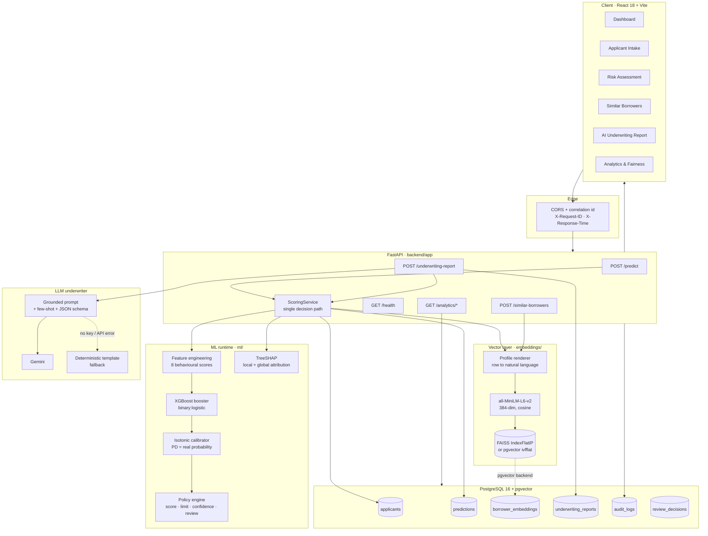
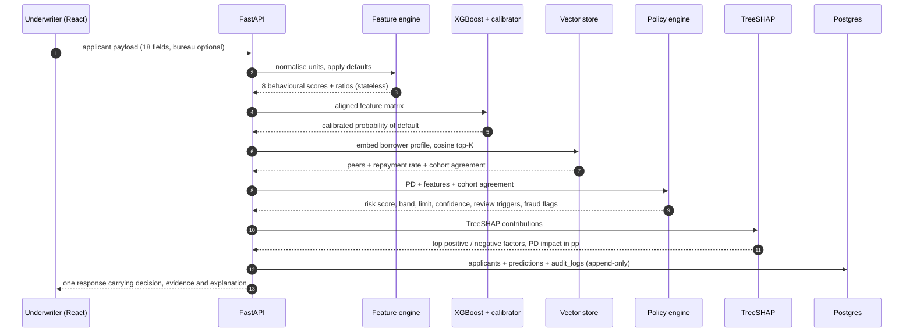
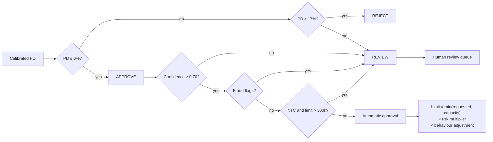

# Architecture

## 1. System overview

## 2. Request flow — `POST /predict`

Cohort retrieval deliberately runs **before** the policy engine: peer agreement is
an input to the confidence score, and confidence decides whether a human must
look at the case.

## 3. Decision logic

## 4. Why each component exists

| Layer | Choice | Rationale |
|---|---|---|
| Model | XGBoost `hist`, native categoricals | Tabular credit data with heavy missingness; learns a split direction for "no bureau score", which is exactly the NTC case |
| Calibration | Isotonic on a held-out split | The policy thresholds a probability. `scale_pos_weight` would inflate PD ~11× and decline the whole book |
| Explainability | TreeSHAP via `pred_contribs` | Exact, additive, no sampling, no extra dependency in the request path |
| Similarity | Sentence embeddings of a rendered profile | Peers are human-readable, so an underwriter can audit what the recommendation leaned on; scale-invariant vs raw feature distance |
| Vector store | FAISS `IndexFlatIP` / pgvector `ivfflat` | Exact cosine at demo scale, one env var to move to the production path |
| LLM | Gemini with a JSON schema + grounded context | The model explains a decision it cannot change; structured output means the API contract never depends on prose parsing |
| Persistence | Append-only `predictions` + `audit_logs` | Every decision reconstructible with its model and policy version — the regulatory requirement |

## 5. Failure behaviour

| Missing | Effect |
|---|---|
| Postgres | In-memory ledger; scoring, explanation and dashboard all still work |
| FAISS index | Falls back to exact numpy cosine over the saved matrix |
| MiniLM weights | Falls back to a deterministic hashing encoder (reported in `/health`) |
| `GEMINI_API_KEY` | Deterministic template memo built from the same SHAP + cohort evidence |
| Trained model | The only hard dependency: `/predict` returns `503` with the exact command to run |
